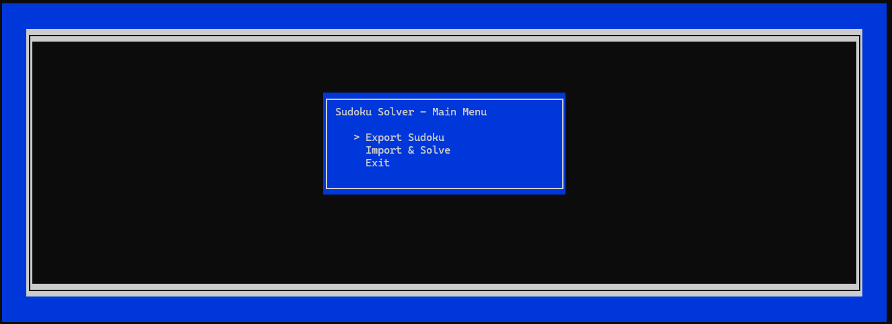
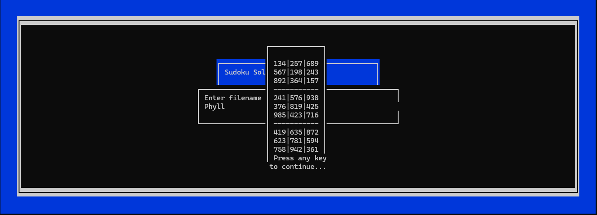

# Sudoku-solver + curses

A sudoku-solver game i made as a dare from one the peoples i know.

to compile this to link the ***main.cpp*** with curses.h (ncurses (*nix only) or pdcurses (windows/*nix)
```
g++ -std=c++17 -o main main.cpp -lcurses
```
```
clang++ -std=c++17 -o main.exe main.cpp -lcurses
```
### (replace main.exe with main (if u are using *nix))


```
...|...|...
...|...|...
..2|...|...
-----------
..1|..6|.3.
...|..9|.2.
..5|...|.1.
-----------
...|...|...
...|...|...
...|...|...
```

